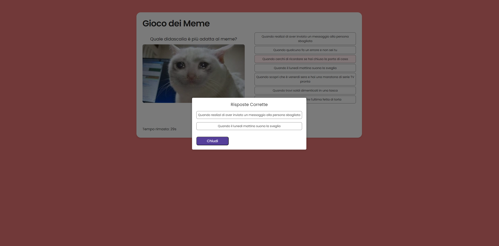
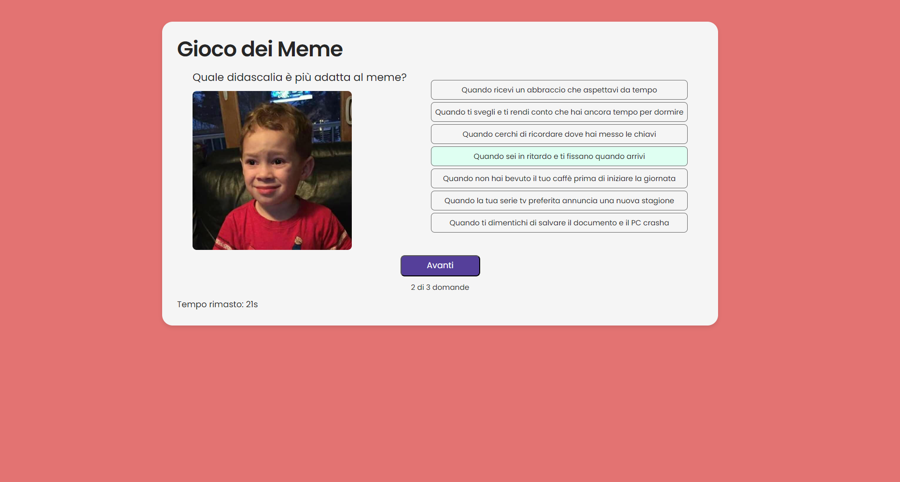

# Exam #1: "Gioco dei Meme"
## Student: s331360 Licitra Davide 

## React Client Application Routes

- Route `/`: main page of the project, contains two buttons (play or login), the button changes if the user is logged.
- Route `/game`: game page with memes and captions
- Route `/login`: page containing the login form.
- Route `/summary`: page containing the summary of the last game, is opened after the game
- Route `/profile`: page containing the history of games played by the logged user
- - Route `*`: default route, contains an error 404 page.

## API Server
MIDDLEWARE
-isAuthenticated: check if the request cames from an authenticated user, if not return error 401

API

- POST `/api/sessions`
  - request Parameters: none
  - request body content: {username,password}
  - response body content: return 201 if username and password are correct
  - return 401 in case of server errors

- GET `/api/sessions/current`
  - request Parameters: none
  - request body content: {username,password}
  - response body content: return 200 with {user}
  - return 401 in case of user not authenticated
  - 
- DELETE `/api/sessions/current`
  - request Parameters: none
  - request body content: {username,password}
  - response body content: return 200       //da modificare
  - return 500 in case of server errors
  
- GET `/api/roundcontent?game_id=${game_id}`
  - request Parameters: { game_id }
  - request body content: none
  - response body content: return 200 with { meme: { id: x, filename: 'x.jpg' }, rightCaptions: [{ id: x, text: 'example', meme_id: x,caption_id: x }],
    rngCaptions: [ { id: x, text: 'example'}]}
  - return 500 in case of server errors
  
- POST `/api/create_game`
  - request Parameters: none
  - request body content: { user_id }
  - response body content: return 201 with { success, game_id }
  - return 500 in case of server errors
   
  
- POST `/api/add_round`
  - request Parameters: none
  - request body content: { game_id, user_id, meme_img, answer, is_correct}
  - response body content: return 201 with { success }
  - return 500 in case of server errors

- GET `/api/history?user_id=${user_id}`
  - request Parameters: { user_id }
  - request body content: none
  - response body content: return 200 with [{ game_id, total_score, meme_img, answer, is_correct, round_score }]
  - return 500 in case of server errors
   
- PATCH `/api/update_score`
  - request Parameters: none
  - request body content: { score, game_id}
  - response body content: return 200 with { success }
  - return 500 in case of server errors
## Database Tables

- Table `user` - contains a wow for each user, attributes are:
  - email TEXT (primay key)
  - name TEXT 
  - hash TEXT 
  - salt TEXT 
  
- Table `Game_Matches` – contains a row for each game match, attributes are:
  - game_id INTEGER (primary key, auto-increment)
  - user_id INTEGER
  - total_score INTEGER (default 0)
  - FOREIGN KEY (user_id) REFERENCES user (id)   
  
- Table `Round_Data` – contains a row for each round of a game match, attributes are:
  - id INTEGER (primary key, auto-increment)
  - game_id INTEGER
  - user_id INTEGER
  - meme_img TEXT   
  - answer TEXT
  - is_correct BOOLEAN
  - FOREIGN KEY (game_id) REFERENCES Game_Matches (game_id)
  - FOREIGN KEY (user_id) REFERENCES user (id)

- Table `Memes` – contains a row for each meme, attributes are:
  - id INTEGER (primary key, auto-increment)
  - filename TEXT (not null)
  - total_score INTEGER (default 0)
  - FOREIGN KEY (user_id) REFERENCES user (id)    

- Table `Captions` – contains a row for each caption, attributes are:
  - id INTEGER (primary key, auto-increment)
  - text TEXT (not null)
  - total_score INTEGER (default 0)
  - FOREIGN KEY (user_id) REFERENCES user (id) 

- Table `MemeCaptions` – contains a row for each meme-caption association, attributes are:
  - meme_id INTEGER
  - caption_id INTEGER
  - PRIMARY KEY (meme_id, caption_id)
  - FOREIGN KEY (meme_id) REFERENCES Memes (id)
  - FOREIGN KEY (caption_id) REFERENCES Captions (id)  
      

## Main React Components

- `HomePage` (in `HomePage.jsx`): contains the buttons to move to the play as guest and login (if user is not logged) and play, logout and profile (logged user)
- `LoginPage` (in `LoginPage.jsx`): contains the page with the login page.
- `LoginForm` (in `LoginForm.jsx`): contains the form for user login.
- `NotFound` (in `NotFound.jsx`): components to handle wrong routes.
- `Profile` (in `Profile.jsx`): contains the full history of user games and rounds.
- `Quiz` (in `Quiz.jsx`): contains the quiz game
- `Summary` (in `Summary.jsx`): contains a summary with only the right answers inserted by the user in the last game (meme-caption selected)

(only _main_ components, minor ones may be skipped)

## Screenshot

## Users Credentials

- username: davide@polito.it, password: test (user with games in his history) 
- username: test@polito.it, password:test (new empty account)
